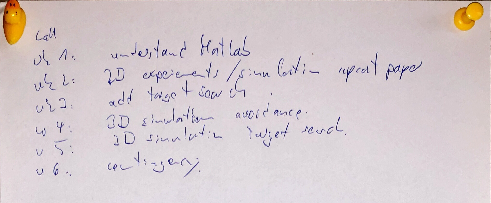
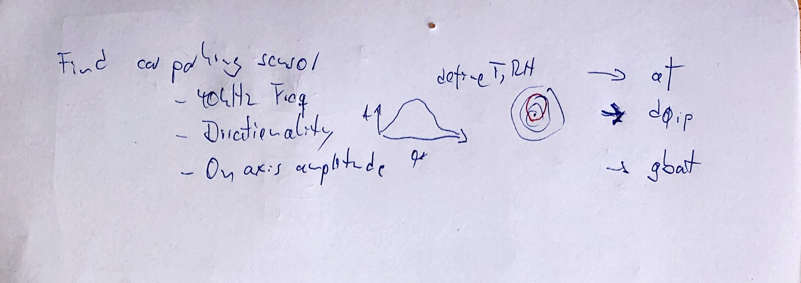
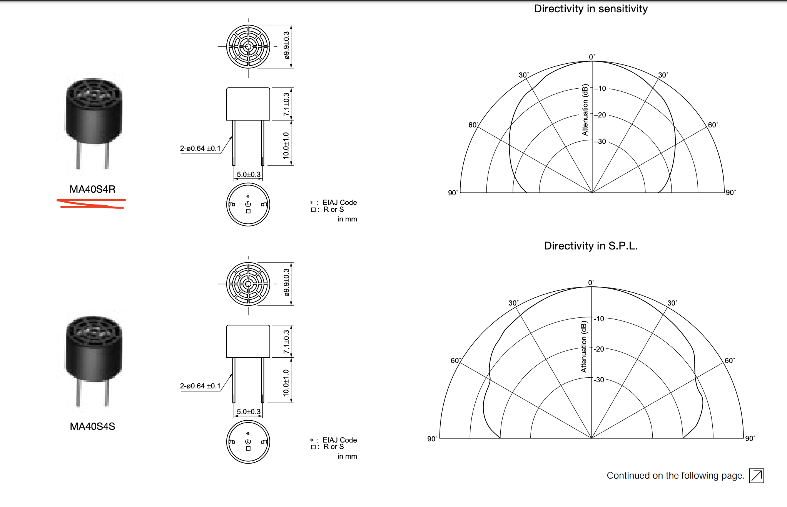
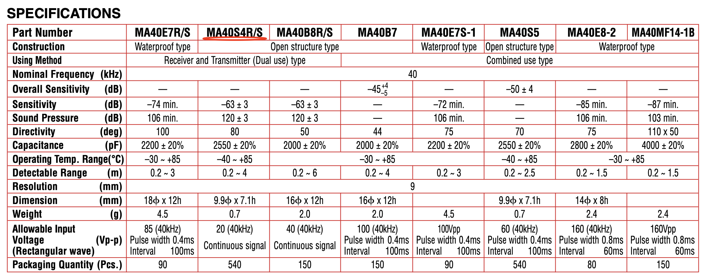

# 24/06/2019
### Timeline 

- W1: understand MATLAB
- W2: 2D experiments (repeat paper)
- w3: add target search
- w4: 3D avoidance simulation
- w5: 3d target search simulation

Find car parking sensor:

- 40KHz Freq
- Directionality / directivity
  - MA40S4R
- On axis amplitude
- Also need to define <b>temperature</b>, <b>湿度</b> to set af

