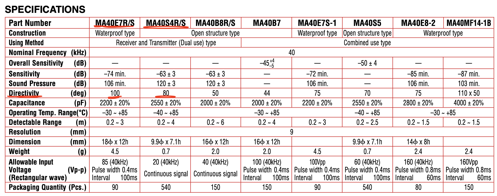

# 24/06/2019
### Timeline 

- W1: understand MATLAB
- W2: 2D experiments (repeat paper)
- w3: add target search
- w4: 3D avoidance simulation
- w5: 3d target search simulation

### Sensor

[ULTRASONIC SENSORS MA40 SERIES](http://pdf.datasheetcatalog.com/datasheets2/57/57682_1.pdf)

[MA40S4R_Sensitivity](http://www.symmetron.ru/suppliers/murata/files/pdf/murata/ultrasonic-sensors.pdf)

[Temperature/ringing time](https://www.murata.com/~/media/webrenewal/products/sensor/ultrasonic/open/applinote_maopn.ashx?la=en)

- **40KHz** Freq
- Directionality / directivity
  - **MA40E7R** (larger directionality 100º compared to MA40S4R )
  - fit function: **(cos(theta)-1)*20**
- On axis amplitude
- Also need to define <b>temperature</b> (best at 25ºC), <b>humidity</b>(60%-100%) to set af
  - af = [-120, -140] dB/(100m•atm) —> [100%, 60%]
  - [sound absorption coeffient graph](https://en.wikibooks.org/wiki/Engineering_Acoustics/Outdoor_Sound_Propagation#/media/File:Atmospheric_sound_absorption_coefficient_2.svg)

###Calculation

1. ri = distance between reflector and bat

2. t (time between call and recieve signal)

3. dϕi ,p of two ears

4. **si** 

5. gi

6. determine gt

   - calculate *travel time / range / directionality* of all reflectors —> put them into a matrix?
- **set gi of reflectors to 0 dB with directionality < -90º or > 90º for two ears relatively**
   - find the reflector with smalliest travel time / find all the reflectors within the +1ms time range
   - calculate gt —> determine turning direction (angular acceleration) 
   - bat speed is determined by distance to the nearest reflector (same one with the smalliest echo travel time)
   
7. Put bat position and speed into a matrix

8. t = 0 —> t = <u>minTravelTime + 50ms + 1ms</u>

   - keep same speed and heading during call and determined turning direction & angular acceleration 
- Generate a new x and y 
   - The maximum decceleration = 4m/s2 (A computational sensorimotor model of bat echolocation)

9. t = <u>minTravelTime + 50ms + 1ms</u> —> t = 100ms

   - change speed (v) and heading before next call 
   - generate a new x and y 

 

### Work Chart

### Project Introduction

- Doctor Holdried had found that the **minimal information** cue that is needed to perform obstacle avoidance of bat echolocation (which is the first 1ms of echoes train recieved by the bats)
  - A system was built based on this and simulated in **2d** environment
- What I am doing is to test it in **3d** environments 
  - In order to do that I will put some additional parameters in it, like **Gravity** and **extra ears**, 
  - and probabily give the bat a **sense of direction** to it, and then it could move towards a target rather than just avoid obstacles
- <u>The idea is to make this model **more robotics**</u>, so I need to change many parameters (the sound pressure of bats call) into robotics industrial standard