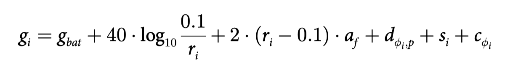

# 3DSensorimotorObstacleAvoidance

Final Project, University of Bristol, MSc Robotics

## Requirements

-  compare how my work different from others (better/worse)
- evaluation methods (ask supervisor)
- discuss methods, valid? contribute something
- know the methodology is the main point of this unit, don’t be afraid of no contribution.
- deadline: 19/09/2019 14:00
- PDF version
- append ethical checklist to paper
- marking results come out in a month

## Introduction

- In this paper, we propose that the Interaural Intensity Difference (**IID**) and travel time of the **first millisecond of the echo train** are sufficient cues for obstacle avoidance.
- Rhinolophidae (long narrow band signal) **—>** other bats (short broad band signal)
- The characteristic **cyclical pinna movements** shown by Rhinolophidae [11, 12] have been suggested to compensate for the lack of spatial cues available to bats relying on broadband calls.
- Moving ears generate changing IIDs encoding the reflector position in both the horizontal and the vertical plane.
- Hence, while it has been shown that pinnae movements play a significant role in obstacle avoidance [3], it is still not clear what information Rhinolophidae extract from such pinna movements to allow them to avoid natural (and complex) obstacles.
- In particular, we propose a sensorimotor system that does not rely on the bat reconstructing the 3D spatial layout of reflectors from the echoes, but instead relies on the dynamics of the bat-obstacle interaction to result in obstacle avoidance behaviour.
- It uses IID and time delay of the first echo onset in combination with alternating pinna movements to guide the bat. In particular, it processes only the first millisecond of the echo train.

## Method

The intensity **g i** (in dB) of the echo received from reflector i:

**gbat** = intensity of the call at 10 cm from the mouth 120 dBspl

**ri** = range to reflector i

**af** = atmospheric absorption at frequency f

**d** **ϕ** **i ,p** = directional sensitivity of the sonar apparatus of the bat for angle ϕ i and pinnae position p

**si** = echo strength of the reflector respectively (物体吸收声音)

**ϕ** **i** = heading direction ϕ i of reflector i

~~**c** **ϕ** **i** = denotes an additional attenuation reflecting changes in cochlear sensitivity for different frequencies~~

**ϕ i,t** is a random phase angle (between −π and π) modeling the interference between narrowband echoes. Note that this phase angle is randomized independently for each reflector i and ear t.

The echoes received at each ear t during the first millisecond after the arrival of the first echo are summed with randomized phase shifts.

​              

## Task Log

24/06

- Can I get any example code? / tutorial?  

  - How the bat interacts with the artificial environments?

- Echoes from all reflectors/obstacles need to be calculated?

- Which elements make the intensity between ears (totally 4) different? (d øi,p ?)

- How is gravity affects bat? 

- Do I need to report any progress?

25/06

- ~~find specific directivity of MA40S4R MA40E7R~~
- ~~define temperature and humidity~~ 

26/06

- ~~define temperature and humidity —> af~~
- ~~try to build a simple model and a timeline with small amount of obstacles~~
- ~~try to determine gt~~ 
- set threhold in matrix / echoes from back set to 0 dB

28/06

- ~~try to determine gt~~
- A static model has been built, then is to build a dynamic model / make it move

04/07

- modified existing code —> able to run
- Next:
  - ~~write makeWorld();~~
  - simulate in 3D space
  - add gravity / limitation of 
  - add target search